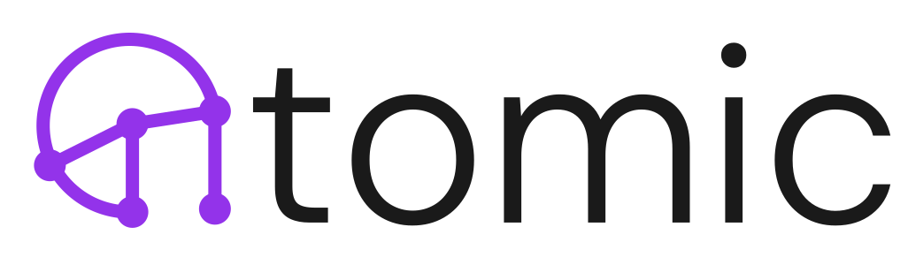
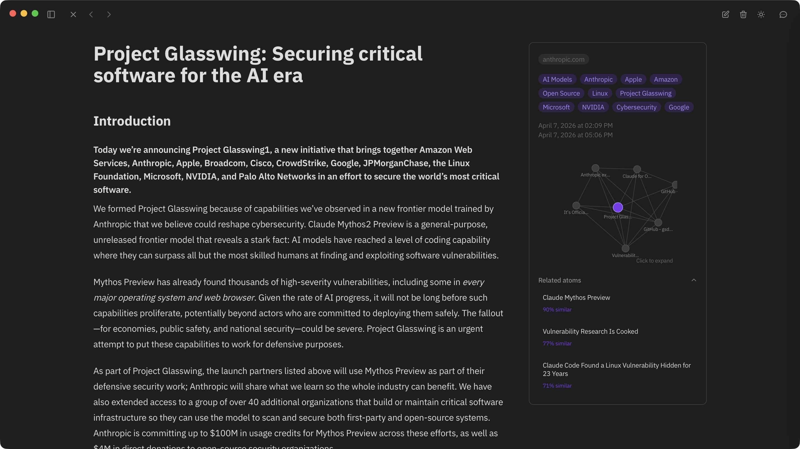
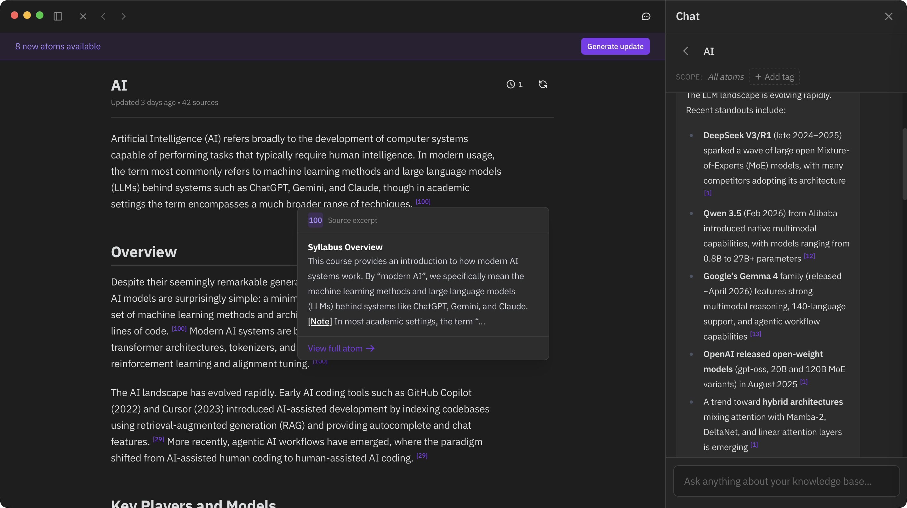
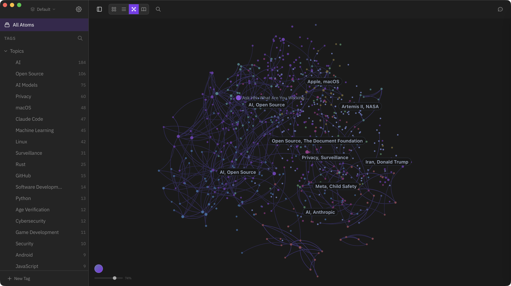
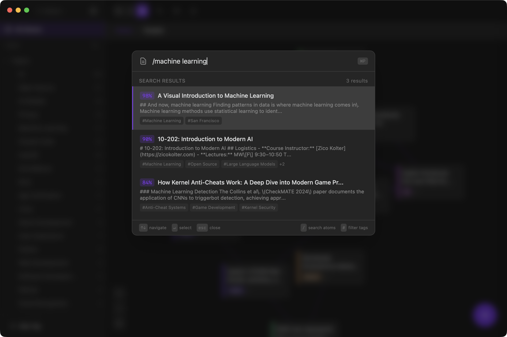

<picture>
  <source media="(prefers-color-scheme: dark)" srcset="./docs/images/logo-dark.svg">
  <source media="(prefers-color-scheme: light)" srcset="./docs/images/logo.svg">
  
</picture>

[](https://discord.gg/fT4vTERhz3)
[](https://github.com/kenforthewin/atomic/releases/latest)
[](https://github.com/kenforthewin/atomic/pkgs/container/atomic-server)
[](https://github.com/kenforthewin/atomic/pkgs/container/atomic-web)
[](https://atomicapp.ai/cloud)

> ☁️ **[Atomic Cloud](https://atomicapp.ai/cloud)** — Atomic, hosted at
> your own subdomain. Try it out for free. Everything below still
> self-hosts forever.

A personal knowledge base that turns markdown notes into a semantically-connected, AI-augmented knowledge graph.

Atomic stores knowledge as **atoms** — markdown notes that are automatically chunked, embedded, tagged, and linked by semantic similarity. Your atoms can be synthesized into wiki articles, explored on a spatial canvas, and queried through an agentic chat interface.

https://github.com/user-attachments/assets/1992fcf7-1d6b-41b1-a177-2da2e8b57676



*Wiki synthesis — LLM-generated articles with inline citations*



*Canvas — view your knowledge on an interactive graph*



*Semantic search — find by meaning, not keywords*



## Features

- **Atoms** — Markdown notes with hierarchical tagging, source URLs, and automatic chunking
- **Semantic Search** — Vector search over your knowledge base using sqlite-vec
- **Canvas** — Force-directed spatial visualization where semantic similarity determines layout
- **Wiki Synthesis** — LLM-generated articles with inline citations, built from your notes
- **Reports** — Scheduled research tasks that turn your atoms into recurring cited findings (daily briefings, contradiction scans, open-question tracking)
- **Chat** — Agentic RAG interface that searches your knowledge base during conversation
- **Auto-Tagging** — LLM-powered tag extraction organized into hierarchical categories
- **Multiple AI Providers** — OpenRouter, Ollama, or any OpenAI-compatible provider for embeddings and LLMs
- **RSS Feeds** — Subscribe to feeds and automatically sync new articles as atoms
- **Browser Extension** — Capture web content directly into Atomic ([Chrome Web Store](https://chromewebstore.google.com/detail/bknijbafnefbaklndpglcmlhaglikccf))
- **MCP Server** — Expose your knowledge base to Claude and other AI tools
- **Multi-Database** — Multiple knowledge bases with a shared registry
- **iOS App** — Native SwiftUI client for reading and writing atoms on mobile ([App Store](https://apps.apple.com/us/app/atomic-kb/id6759266634))

## Getting Started

Atomic runs as a **desktop app** (Tauri), a **headless server** (Docker/Fly.io), or both.

### Desktop App

Download the latest release for your platform from [GitHub Releases](https://github.com/kenforthewin/atomic/releases) (macOS, Linux, Windows).

On first launch, the setup wizard walks you through AI provider configuration.

### Self-Host with Docker Compose

```bash
git clone https://github.com/kenforthewin/atomic.git
cd atomic
echo "ATOMIC_SETUP_TOKEN=$(openssl rand -base64 24)" > .env
docker compose up -d
```

This starts three services: the API server, the web frontend, and an nginx reverse proxy. Open `http://localhost:8080` and claim your instance through the setup wizard with the `ATOMIC_SETUP_TOKEN` value from `.env`.

The proxy service is provided for convenience — if you already run your own reverse proxy (Caddy, Traefik, etc.), you can skip it and route traffic to the `server` and `web` containers directly. See `docker/nginx.conf` for an example configuration.

### Deploy to Fly.io

```bash
cp fly.toml.example fly.toml
fly launch --copy-config --no-deploy
fly volumes create atomic_data --region <your-region> --size 1
fly secrets set ATOMIC_SETUP_TOKEN="$(openssl rand -base64 24)"
fly deploy
```

Open `https://your-app.fly.dev` and claim your instance with the setup token. The public URL for OAuth/MCP is auto-detected from the Fly app name.

### Standalone Server

```bash
ATOMIC_SETUP_TOKEN="$(openssl rand -base64 24)" \
cargo run -p atomic-server -- --data-dir ./data serve --port 8080
```

On first run, enter `ATOMIC_SETUP_TOKEN` in the setup wizard, or create an API token directly:

```bash
cargo run -p atomic-server -- --data-dir ./data token create --name default
```

## AI Provider Setup

Atomic needs an AI provider for embeddings, tagging, wiki generation, and chat.

- **OpenRouter** — Get an API key from [openrouter.ai](https://openrouter.ai). Supports separate model selection for embedding, tagging, wiki, and chat.
- **Ollama** — Install [Ollama](https://ollama.com) and pull models (e.g., `ollama pull nomic-embed-text`). Atomic auto-discovers available models.
- **OpenAI-compatible** — Any provider with an OpenAI-compatible API (e.g., OpenAI, Azure OpenAI, Together, Groq). Configure the base URL and API key.

Configure via the setup wizard on first launch, or later in Settings.

## Browser Extension

The Atomic Web Clipper captures web content as atoms. Install from the [Chrome Web Store](https://chromewebstore.google.com/detail/bknijbafnefbaklndpglcmlhaglikccf), then configure your server URL and API token in the extension options.

Captures are queued offline and synced when the server is available.

## MCP Server

Atomic exposes an MCP endpoint for Claude and other AI tools to search, read, create, update, and ingest atoms.

### Desktop App (Local Mode)

The desktop app bundles `atomic-mcp-bridge`, a stdio-to-HTTP bridge that reads the local auth token automatically. No token configuration needed — just point your MCP client at the binary:

```json
{
  "mcpServers": {
    "atomic": {
      "command": "/Applications/Atomic.app/Contents/MacOS/atomic-mcp-bridge"
    }
  }
}
```

The app's Settings > Integrations page shows the exact path for your system.

### Remote / Self-Hosted

For remote servers or the web app, connect via the HTTP endpoint at `/mcp` with a Bearer token:

```json
{
  "mcpServers": {
    "atomic": {
      "type": "url",
      "url": "https://your-server.com/mcp",
      "headers": {
        "Authorization": "Bearer YOUR_TOKEN"
      }
    }
  }
}
```

Create a token from Settings > Connection > API Tokens, or via the CLI:

```bash
atomic-server token create --name "claude"
```

**Available tools:** `semantic_search`, `read_atom`, `create_atom`, `ingest_url`, `update_atom`

## Architecture

All business logic lives in `atomic-core`, a standalone Rust crate with no framework dependencies. `atomic-server` wraps it with a REST API, WebSocket events, and an embedded MCP endpoint. Every client connects to `atomic-server` over HTTP:

```
                    +------------------+
                    |   atomic-core    |
                    |   (all logic)    |
                    +--------+---------+
                             |
                    +--------v---------+
                    |  atomic-server   |
                    | (REST + WS + MCP)|
                    +--------+---------+
              +---------+----+----+---------+
              v          v        v         v
    +-----------+  +----------+  +------+  +----------+
    | src-tauri |  | React UI |  | iOS  |  |mcp-bridge|
    | (sidecar) |  | (browser)|  | app  |  | (stdio)  |
    +-----+-----+  +----------+  +------+  +-----+----+
          |                                       |
    +-----v-----+                           +-----v-----+
    |  React UI  |                          | MCP clients|
    | (desktop)  |                          |(Claude,etc)|
    +------------+                          +------------+
```

## Project Structure

```
Cargo.toml                  # Workspace root
crates/atomic-core/         # All business logic
crates/atomic-server/       # REST + WebSocket + MCP server
crates/mcp-bridge/          # HTTP-to-stdio MCP bridge
src-tauri/                  # Tauri desktop app (launches server as sidecar)
src/                        # React frontend (TypeScript)
extension/                  # Chromium browser extension
scripts/                    # Import and utility scripts
```

## Development

### Prerequisites

- Node.js 22+
- Rust toolchain ([rustup](https://rustup.rs))
- For the desktop app: platform-specific [Tauri v2 dependencies](https://v2.tauri.app/start/prerequisites/)

### Commands

```bash
npm install                       # Install frontend dependencies

# Desktop app
npm run tauri dev                 # Dev with hot reload
npm run tauri build               # Production build

# Server only
cargo run -p atomic-server -- serve --port 8080

# Frontend only
npm run dev                       # Vite dev server

# Checks
cargo check                       # All workspace crates
cargo test                        # All tests
npx tsc --noEmit                  # Frontend type check
```

## Tech Stack

| Layer | Technology |
|-------|------------|
| Core | Rust, SQLite + sqlite-vec, tokio |
| Desktop | Tauri v2 |
| Server | actix-web |
| Frontend | React 18, TypeScript, Vite 6, Tailwind CSS v4, Zustand 5 |
| Editor | CodeMirror 6 |
| Canvas | Sigma.js, Graphology |
| AI | OpenRouter, Ollama, or OpenAI-compatible (pluggable) |

## License

MIT
